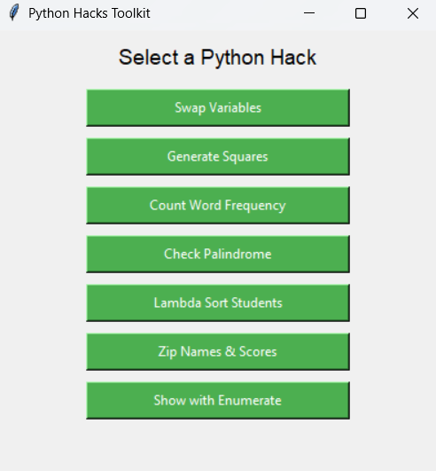

## 📸 Screenshot



# 🧠 Python Hacks Toolkit

A beginner-friendly **Python desktop GUI app** that showcases 7 powerful Python hacks using Tkinter.

This tool is designed to **demonstrate clean and clever Python tricks**, useful for interviews, learning, or mini project showcases.

---

## 🔍 Features

| Hack                          | Description                              |
|-------------------------------|------------------------------------------|
| Swap Variables                | Swap two numbers without a temp variable |
| List Comprehension            | Generate squares using `[x**2 for x in range(n)]` |
| Word Counter (`Counter`)      | Count frequency of each word in text     |
| Palindrome Checker            | Check if a string is a palindrome        |
| Lambda Sort                   | Sort students by score using lambda      |
| Zip Merge                     | Combine names & scores using `zip()`     |
| Enumerate Print               | Print index & value using `enumerate()`  |

---

## 🖥️ How to Run

### ✅ Requirements
- Python 3.x
- `tkinter` module (preinstalled in most systems)

### ▶️ Run Locally

```bash
git clone https://github.com/YOUR_USERNAME/python-hacks-toolkit.git
cd python-hacks-toolkit
python main.py
